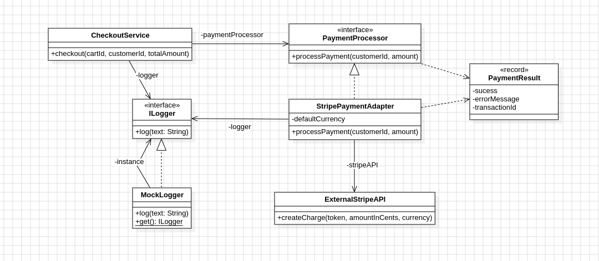

# LP5_Adapter

Neste projeto, foi implementado um simples sistema de pagamento, que suporta múltiplas formas de pagamento, cada uma com suas especificidades. Com isso, usamos o padrão Adapter para realizar a conexão entre o sistema e o gateway de pagamento, adaptando valores de forma diferente.

## Diagrama de Classe

